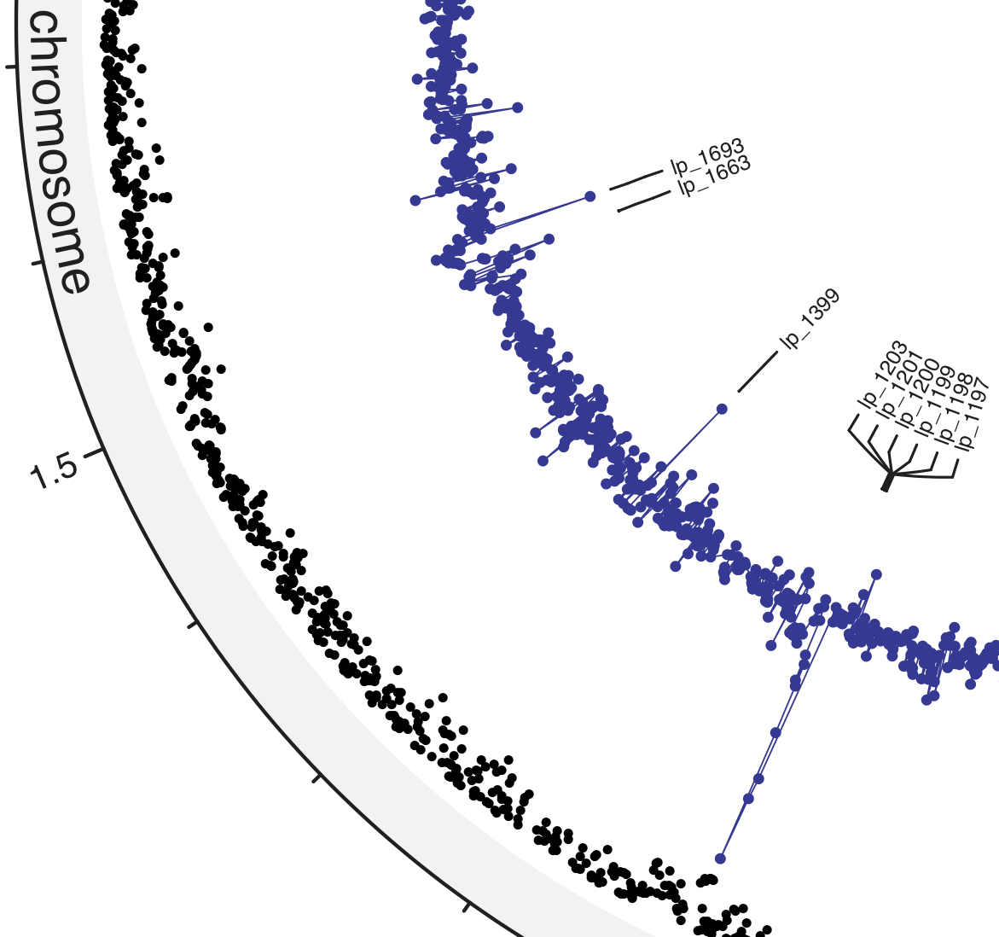

# Circos plots for proteomics and transcriptomics data

## How-to

This example uses *[L. plantarum](https://www.genome.jp/kegg-bin/show_organism?org=lpl)*. Data in `example.csv` is taken from a TSV file (`rpkm_0_ADTV7`) from the study [here](https://www.ncbi.nlm.nih.gov/pmc/articles/PMC6459948/). The feature table and assembly report are from [here](ftp://ftp.ncbi.nlm.nih.gov/genomes/all/GCF/000/203/855/GCF_000203855.3_ASM20385v3).

The Rmd uses LIMMA to calculate log2 fold change and moderated p-values. These values, along with genome coordinates, are then plotted using [circlize](https://github.com/jokergoo/circlize).
